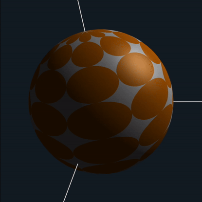
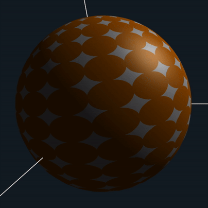
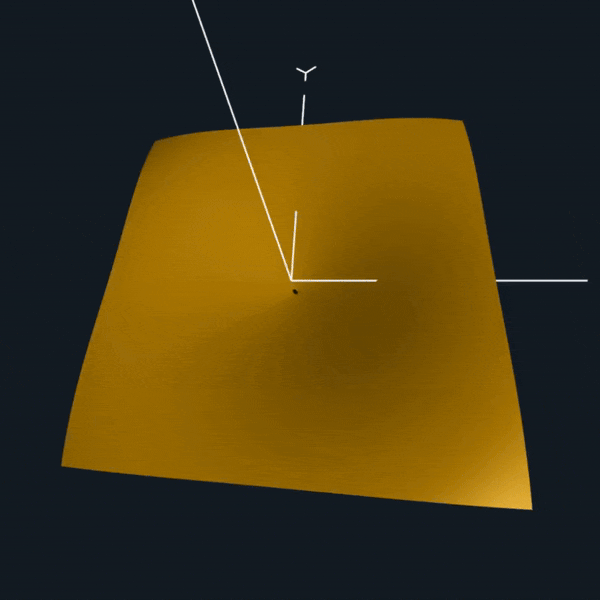
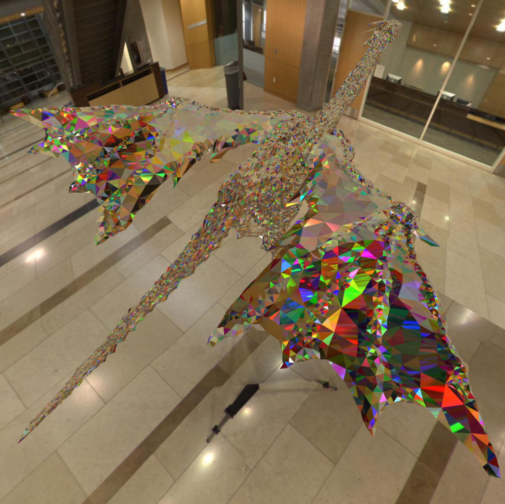
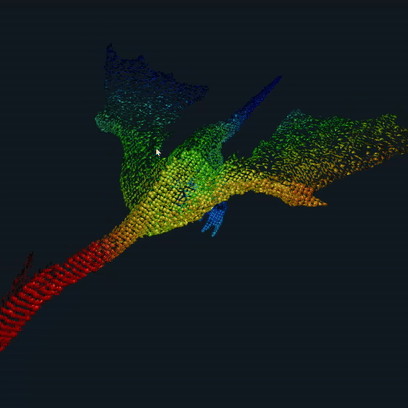

# CS 457 - Computer Graphics Shaders

Here are all my projects from CS 457 - Computer Graphics Shaders with Dr. Mike Bailey. I learned about the different types of shaders (vertex, tessellation, geometry, fragment, compute..) and implemented a variety of shader tricks in C++ with OpenGL and GLSL.

Check out my pdfs folder to read about my approach to each project!

## Step- and Blended-edged Elliptical Dots

## Noisy Elliptical Dots

## Displacement Mapping, Bump Mapping, and Lighting

## Cube Mapping Reflective and Refractive Bump-mapped Surfaces

## Image Manipulation

## The Dragon Menagerie Project 

In celebration of the Year of the Dragon, everyone got to implement whatever shader they wanted on a dragon OBJ. I made a chromatic aberration shader that gives the dragon a diamondesque look.

## Geometry Shaders

## Final Project - Skin Shader (WIP)
